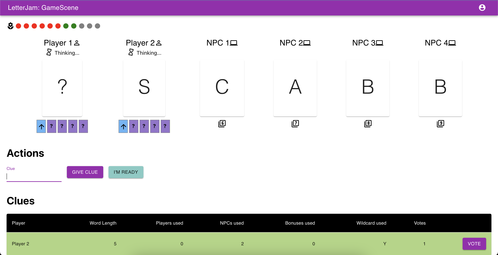
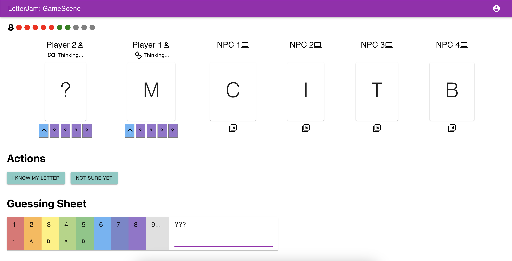

# Letter Jam

An implementation of the [Letter Jam board game](https://boardgamegeek.com/boardgame/275467/letter-jam).

**Screenshots**


_Giving Clues_


_Guessing Sheet_

## Development

Install dependencies

```
$ npm install
```

### Dev Server

Start the local development server

```
npm start
```

### Prod Server

Ready for production? Build the production ready code to the /dist folder

```
$ npm run build
```

then play your production ready game in the browser

```
$ npm run startProd
```
